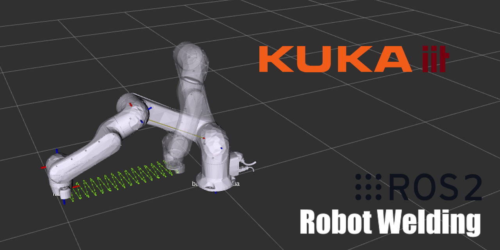

# Introduction

This is a homework project for a KUKA & BME-VIK collaboration lecture. The goal of this project is to plan a superposed linear and sinusoidal trajectory for welding with a KUKA LBR iisy 11 robot.

<p align="center">
  
</p>

# Dependencies
- [ROS2 Humble](https://docs.ros.org/en/humble/Installation.html)
- [ROS2 KUKA drivers](https://github.com/kroshu/kuka_drivers/wiki)
- [ROS2 Control](https://control.ros.org/master/doc/getting_started/getting_started.html#installation)

Using the iiQKA robot driver and ROS2 control requires the following packages to be installed:
```bash
sudo apt install -y libnanopb-dev libgrpc++-dev ros-humble-ros2-control ros-humble-ros2-controller
```

# System Informations
| Information      | Value |
| :---        |    :----:   |
| ROS2 Version | Humble |
| Robot Model | [LBR iisy 11](https://www.kuka.com/event/media?itemId=3EE29492F391404491777BF684749DE2) |
| SRDF | [kuka_lbr_iisy_moveit_config/srdf/lbr_iisy11_r1300_arm.srdf.xacro](https://github.com/kroshu/kuka_robot_descriptions/blob/master/kuka_lbr_iisy_moveit_config/srdf/lbr_iisy11_r1300_arm.srdf.xacro) |

# Get Started
Use the tasks in `.vscode/tasks.json` to build and start.

> Press **CTRL + ALT + P**, then type and select **Tasks: Run Task**.

## Build
Using `colcon build`.
```json
{
    "label": "Build",
    "type": "shell",
    "command": "echo 'Building package...' && colcon build",
    "options": {
        "cwd": "${workspaceFolder}"
    },
    "problemMatcher": []
}
```

## Launch
Launching RViz cannot be done from a VSCode task, so use an external terminal.
```bash
source install/setup.bash
ros2 launch iiqka_moveit_welding moveit_welding_planning.launch.py
```

## Lifecycle
After all components have started successfully, the system needs to be configured and activated to start the simulation, the robot will be visible in RViz after activation.
```json
{
    "label": "Lifecycle configure & activate",
    "type": "shell",
    "command": "ros2 lifecycle set robot_manager configure && ros2 lifecycle set robot_manager activate",
    "options": {
        "cwd": "${workspaceFolder}"
    },
    "problemMatcher": []
}
```

## Run
Run the `src/MoveitWelding.cpp` robot program.
```json
{
    "label": "Run",
    "type": "shell",
    "command": "echo 'Sourcing package...' && source install/setup.bash && echo 'Running node...' && ros2 run iiqka_moveit_welding iiqka_moveit_welding",
    "options": {
        "cwd": "${workspaceFolder}"
    },
    "problemMatcher": []
}
```

# Documentation
Documentation of the implementation can be found in the `docs` folder.

| Language      | File |
| :---        |    :----:   |
| HU | [docs/HU.md](docs/HU.md) |