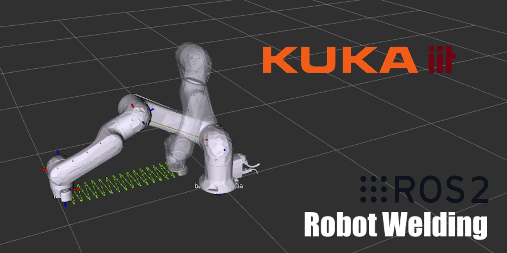

<p align="center">
  
</p>

# Tartalomjegyzék
- [Tartalomjegyzék](#tartalomjegyzék)
- [GitHub](#github)
- [1. Célkitűzés](#1-célkitűzés)
- [2. Megvalósítás](#2-megvalósítás)
  - [2.1. Előzmények](#21-előzmények)
  - [2.2. Csomag](#22-csomag)
  - [2.3. Indítás](#23-indítás)
  - [2.4. Konfiguráció](#24-konfiguráció)
  - [2.5. Pályatervezés](#25-pályatervezés)
- [3. Bemutató](#3-bemutató)

# GitHub
[https://github.com/fazakaserik/iiqka_moveit_welding](https://github.com/fazakaserik/iiqka_moveit_welding)

# 1. Célkitűzés

A projekt célja az alábbi feladatkiírás megvalósítása:

**„Hegesztés” LBR iisy 11 robottal**: *Mozgassák a robot végberendezését egy, a munkatérben előírt pálya mentén! A pálya egy
egyenes szakaszból és egy rászuperponálódó A amplitúdójú, H frekvenciájú szinusz hullámból
áll. A pálya bejárásának sebessége konstans. A pálya paramétereit konfigurációs fájlban
lehessen megadni. Először jelenítsék meg a pályát, utána mozgassák rajta a robotot. (Tipikus
értékek: A = 3mm, H = 3Hz.)*

A feladaton felül fejlesztői célokat is tűztünk ki:
- Könnyedén bővíthető legyen a kód
- Könnyedén érthető legyen a kód

# 2. Megvalósítás

## 2.1. Előzmények
A projekt megvalósításához a [KROSHU](https://github.com/kroshu) csapat [kuka_drivers](https://github.com/kroshu/kuka_drivers) repository-t használtuk alapul, amelyben található egy példa, [iiqka_moveit_example](https://github.com/kroshu/kuka_drivers/tree/master/examples/iiqka_moveit_example) néven. Mivel a feladatunk az LBR iisy 11 használata, ezért az iiQKA példacsomag kiváló kiindulást adott.

## 2.2. Csomag
Először átalakítottuk a mintacsomagot, hogy megfeleljen a saját elképzeléseinknek, így a csomag át lett nevezve `iiqka_moveit_welding`-nak. Ehhez módosítani kellett a `CMakeLists.txt` fájlt. 

## 2.3. Indítás
A launch fájlok közül csak egy darabra volt szükségünk, amelyet szintén átnevezetünk `moveit_welding_planning.launch.py`-ra. Ezen felül a launch fájl `robot_model` argumentumának alapértelemzett értékét `lbr_iisy11_r1300`-ra állítottuk, mivel ez volt a feladatban specifikálva.
```python
def generate_launch_description():
    launch_arguments = []
    launch_arguments.append(DeclareLaunchArgument(
        'robot_model',
        default_value='lbr_iisy11_r1300'
    ))
    return LaunchDescription(launch_arguments + [OpaqueFunction(function=launch_setup)])
```
A pontos robot konfiguráció nevét a [kuka_robot_descriptions](https://github.com/kroshu/kuka_robot_descriptions/tree/master) KROSHU repository [kuka_lbr_iisy_moveit_config/srdf](https://github.com/kroshu/kuka_robot_descriptions/tree/master/kuka_lbr_iisy_moveit_config/srdf) mappájából találtuk meg.

## 2.4. Konfiguráció
A feladat szerint *"A pálya paramétereit konfigurációs fájlban
lehessen megadni."*, így létrehoztunk egy `trajectory.yaml` konfigurációs fájlt, ami tartalmazza a lineáris és szinuszos mozgás paramétereit.
```yaml
lin:
  translation:
    x: 0.7
    y: 0.0
    z: 0.0
  rotation:
    x: 0.0
    y: 0.0
    z: 1.0
    w: 0.0
sin:
  amplitude: 0.1
  frequency: 1.0
```

## 2.5. Pályatervezés

A pályatervezéshez a `moveit::planning_interface::MoveGroupInterface` osztályt használtuk, amely a MoveIt C++ API-jának része. Az osztály egy pályatervezési metódusa a `computeCartesianPath`, amely egy elmozdulások és forgatásokat tartalmazó `geometry_msgs::msg::Pose` vektorból, illetve egy a vektor elemei közt eltelt időből képes trajektóriát számolni.

```c++
moveit_msgs::msg::RobotTrajectory::SharedPtr planFromWaypoints(Waypoints& waypoints)
{
    moveit_msgs::msg::RobotTrajectory trajectory;

    double fraction = move_group_interface_->computeCartesianPath(waypoints.vector, 0.005, 0.0, trajectory);

    if (fraction < 1) {
        return nullptr;
    }

    return std::make_shared<moveit_msgs::msg::RobotTrajectory>(trajectory);
}
```

A vektor tartalmazza időközönként a pálya egyes pontjait és a robot ottani konfigurációját. Ennek absztrakciójához hoztuk létre a `Waypoints` osztályt.

```c++
class Waypoints
{
public:
    std::vector<geometry_msgs::msg::Pose> vector;
    // ...
}
```

Az osztály egyik fontos metódusa a `set_zeros`, amely segítségével inicializálni tudjuk a vektort olyan konfigurációkkal, amelyek minden értéke `0`. Ez láthatóan azt is jelenti, hogy a vektor hosszát ilyen módon meg tudjuk adni és azt inicializálni.
```c++
void set_zeros(uint steps) 
{
    auto zero = Eigen::Isometry3d(
        Eigen::Translation3d(0.0, 0.0, 0.0) * Eigen::Quaterniond( 0.0, 0.0, 0.0, 0.0)
    );
    set_vector(zero, steps);
}
```
Az inicializáció után, mivel minden konfiguráció értéke `0`, ezért az a szimulációban is az origót jelentené, azonban ha nem az origóbol szeretnénk mozgást végezni, pl.: relatív mozgás az effektortól, akkor a `set_origin` metódussal be tudjuk állítani a vektor minden elemét.
```c++
void set_origin(const Eigen::Isometry3d& origin)
{
    set_vector(origin, vector.size());
}
```

A `Waypoints` osztály általi pályatervezést a `WaypointsBuilder` osztály könnyíti meg, amely a *builder pattern* tervezésre épül.
```c++
class WaypointsBuilder
{
private:
    Waypoints waypoints_;

public:

    WaypointsBuilder(uint steps, const geometry_msgs::msg::Pose& origin)
    {
        waypoints_.set_zeros(steps);
        waypoints_.set_origin(origin);
    }
    WaypointsBuilder(uint steps, const Eigen::Isometry3d& origin)
    {
        waypoints_.set_zeros(steps);
        waypoints_.set_origin(origin);
    }

    WaypointsBuilder& addMotion(IMotion& motion) 
    {
        motion.apply(waypoints_);
        return *this;
    }

    Waypoints build() 
    {
        return waypoints_;
    }
};
```

Látható, hogy az `addMotion` metódus egy `IMotion` leszármazott - mivel interfész - objektumot vár paraméterül, amely a feladat megoldása miatt `LinearMotion` és `SinusoidalMotion` lehet. Ebből látható, hogy új mozgásforma bevezetésekör igen könnyen bővíthető a jelenlegi implementáció.
```c++
class IMotion
{
public:
    virtual void apply(Waypoints& waypoints) = 0;
    virtual ~IMotion() {}
};
```
Az `IMotion` interfész `apply` metódusa a pontvektorral szuperponálja az adott mozgást.
```c++
// Lineáris mozgás
class LinearMotion : public IMotion
{
private:
    geometry_msgs::msg::Pose goal_;
public:
    // ...
    void apply(Waypoints& waypoints) override 
    {
        size_t vector_size = waypoints.vector.size();

        for (uint i = 0; i < vector_size; i++) {
            double t = static_cast<double>(i+1) / vector_size;
            waypoints.vector.at(i).position.x += t * goal_.position.x;
            waypoints.vector.at(i).position.y += t * goal_.position.y;
            waypoints.vector.at(i).position.z += t * goal_.position.z;
        }
    }
};

// Szinuszos mozgás
class SinusoidalMotion : public IMotion
{
private:
    double amplitude_;
    double frequency_;

public:
    // ...
    void apply(Waypoints& waypoints) override 
    {
        size_t vector_size = waypoints.vector.size();

        double time_step = 1.0 / frequency_;
        for (uint i = 0; i < vector_size; i++) {
            waypoints.vector.at(i).position.y += amplitude_ * sin(frequency_ * time_step * (i+1));
        }
    }
};
```

A `WaypointsBuilder` osztályt a következőképpen alkalmaztuk a fő programban:
```c++
// Relatív mozgatáshoz, legyen az origó az aktuális end effector konfiguráció
auto origin = welding_node->moveGroupInterface()->getCurrentPose().pose;

// Lineáris mozgás
Eigen::Isometry3d lin;
// Szinuszos mozgás
double amplitude;
double frequency;

// ... értékadás ...

// Mozgások létrehozása
LinearMotion linearMotion(lin);
SinusoidalMotion sinusoidalMotion(amplitude, frequency);

// Vektor inicializálása 100 ponttal az end effektortól mérve
WaypointsBuilder builder(100, origin);

// Mozgások szuperponálása
builder.addMotion(linearMotion)
       .addMotion(sinusoidalMotion);

// Pontvektor létrehozása
Waypoints waypoints = builder.build();

// Trajektória tervezés
trajectory = welding_node->planFromWaypoints(waypoints);
```

# 3. Bemutató

A program működését az alábbi YouTube videó mutatja be:

[KUKA LBR iisy 11 Hegesztés ROS2/MoveIt | Robot operációs rendszerek és fejlesztői ökoszisztémák](https://youtu.be/8OSoGHXrolE)

